[](https://elmadichoaib.vercel.app)  

# Bare Metal Programming

`Bare metal programming` refers to writing software that runs directly on the hardware of a microcontroller without the support of an operating system or IDE. It involves manually managing hardware resources, such as memory, peripherals, and interrupts. This approach allows for more control over the hardware and is often used in embedded systems where performance and efficiency are critical.

## C Programs Compilation Process

When we write a C program for a microcontroller, it goes through several steps before it can actually run on the hardware. This process includes compiling the code, assembling it, linking it into an executable, and finally flashing it onto the microcontroller.

```mermaid
graph LR
    subgraph Coding...[💻 Coding...]
        User_Application["User Application<br>(.c, .h files)"]
    end

    subgraph Building...[⚒️ Building...]
        Compiler --> Assembler["Assembler<br>(.o files)"]
        Assembler --> Linker["Linker<br>(.bin, .exe, .elf files)"]
    end

    subgraph Flashing...[📂 Flashing...]
        Programmer_and_Debugger[Programmer and<br>Debugger]
        Linker --> Programmer_and_Debugger
    end

    subgraph Running...[🏃 Running...]
        Programmer_and_Debugger --> Flash[uC Flash<br>Memory]
    end

    User_Application --> Compiler["Compiler<br>(.s, .asm files)"]

    class Coding... coding
    class User_Application user_app;
    class Building... building;
    class Compiler compiler;
    class Assembler assembler;
    class Linker linker;
    class Flashing... flashing;
    class Programmer_and_Debugger p_and_d;
    class Running... running;
    class Flash flash;

    classDef coding fill:#3D90D710,stroke:#3D90D7,stroke-width:2px,color:#3D90D7;
    classDef user_app fill:#FE774310,stroke:#FE7743,stroke-width:2px,color:#FE7743;
    classDef building fill:#3A59D110,stroke:#3A59D1,stroke-width:2px,color:#3A59D1;
    classDef compiler fill:#BE598510,stroke:#BE5985,stroke-width:2px,color:#BE5985;
    classDef assembler fill:#5F8B4C10,stroke:#5F8B4C,stroke-width:2px,color:#5F8B4C;
    classDef linker fill:#A89C2910,stroke:#A89C29,stroke-width:2px,color:#A89C29;
    classDef flashing fill:#81E7AF10,stroke:#81E7AF,stroke-width:2px,color:#81E7AF;
    classDef p_and_d fill:#FE774910,stroke:#FE7749,stroke-width:2px,color:#FE7749;
    classDef running fill:#F5C45E10,stroke:#F5C45E,stroke-width:2px,color:#F5C45E;
    classDef flash fill:#E5202010,stroke:#E52020,stroke-width:2px,color:#E52020;

    linkStyle 4 stroke:#FE7743,stroke-width:2px;
    linkStyle 0 stroke:#BE5985,stroke-width:2px;
    linkStyle 1 stroke:#5F8B4C,stroke-width:2px;
    linkStyle 2 stroke:#A89C29,stroke-width:2px;
    linkStyle 3 stroke:#FE7749,stroke-width:2px;
```

<div align="center">



</div>

Here's a quick overview of the main stages in the build process and what each one does.

<div align="center">

| Preprocessor                           | Compiler                 | Assembler                           | Linker                     |
| -------------------------------------- | ------------------------ | ----------------------------------- | -------------------------- |
| - Remove comments                      | - Generate assembly code | - Generate relocatable object files | - Combine object files     |
| - Replace macros                       |                          |                                     | - Link libraries           |
| - Include header files                 |                          |                                     | - Produce final executable |
| - Produce translation unit (`.i file`) |                          |                                     |                            |

</div>

## Cross Compilation and Toolchains

`Cross-compilation` is a process in which the cross-toolchain runs on the host machine (your PC) and creates executables that run on different machine (ARM).

`Cross-toolchain` is a collection of binaries which allows you to compile, assemble and link your applications. It contains binaries to debug the application on the target and analyze executables:

- Disassemble executables
- Dissect different sections of an executable
- Extract symbol and size information
- Convert executables to other formats (bin, ihex, ...)
- Provide C standard libraries

The toolchain we will use is GCC (`GNU Compiler Collection`), a free and open-source tool for ARM embedded processors.

### Download the GCC Toolchain

If you have installed STM32CubeIDE, the GCC toolchain is already installed with it.

If not, you can download it manually from this link: [ARM GNU Toolchain Downloads](https://developer.arm.com/downloads/-/arm-gnu-toolchain-downloads).

I am using a Windows machine, so I installed the `arm-none-eabi` version.

<div align="center">


</div>

### Important Cross Toolchain Binaries

- Compiler, Assembler, Linker `⟶` arm-none-eabi-gcc
- Assembler &nbsp;&nbsp;&nbsp;&nbsp;&nbsp;&nbsp;&nbsp;&nbsp;&nbsp;&nbsp;&nbsp;&nbsp;&nbsp;&nbsp;&nbsp;&nbsp;&nbsp;&nbsp;&nbsp;&nbsp;&nbsp;&nbsp;&nbsp;&nbsp;&nbsp;&nbsp;&nbsp; `⟶` arm-none-eabi-as
- Linker &nbsp;&nbsp;&nbsp;&nbsp;&nbsp;&nbsp;&nbsp;&nbsp;&nbsp;&nbsp;&nbsp;&nbsp;&nbsp;&nbsp;&nbsp;&nbsp;&nbsp;&nbsp;&nbsp;&nbsp;&nbsp;&nbsp;&nbsp;&nbsp;&nbsp;&nbsp;&nbsp;&nbsp;&nbsp;&nbsp;&nbsp;&nbsp;&nbsp;&nbsp; `⟶` arm-none-eabi-ld
- ELF File Analyzers &nbsp;&nbsp;&nbsp;&nbsp;&nbsp;&nbsp;&nbsp;&nbsp;&nbsp;&nbsp;&nbsp;&nbsp;&nbsp;&nbsp;&nbsp;&nbsp; `⟶` arm-none-eabi-objdump, arm-none-eabi-readelf, arm-none-eabi-nm
- Format Converter &nbsp;&nbsp;&nbsp;&nbsp;&nbsp;&nbsp;&nbsp;&nbsp;&nbsp;&nbsp;&nbsp;&nbsp;&nbsp;&nbsp;&nbsp;&nbsp; `⟶` arm-none-eabi-objcopy

### Basic Compilation Commands

The following command compiles and assembles the `main.c` file without linking, and outputs a relocatable object file `main.o`:

```bash
arm-none-eabi-gcc -c main.c -o main.o
```

This next command does the same thing but specifies the target ARM processor (`cortex-m4`) and tells the compiler to generate Thumb instruction set code:

```bash
arm-none-eabi-gcc -c -mcpu=cortex-m4 -mthumb main.c -o main.o
```

This command generates only the assembly code from `main.c`, without assembling it into an object file:

```bash
arm-none-eabi-gcc -S -mcpu=cortex-m4 -mthumb main.c -o main.s
```

### Automating Compilation with a Makefile

Instead of typing long commands every time, you can automate the process using a simple `Makefile`:

```Makefile
CC=arm-none-eabi-gcc
MACH=cortex-m4
CFLAGS= -c -mcpu=$(MACH) -mthumb -std=gnu11 -O0

# TARGET: DEPENDENCY
main.o: main.c
	$(CC) $(CFLAGS) $^ -o $@

# $^ --> dependencies (main.c)
# $@ --> target (main.o)

```

Now, just typing:

```bash
make
```

Will automatically compile `main.c` into `main.o` based on the rules you defined!

If you want to dive deeper into build systems like Makefiles, CMake, and how projects are organized and automated, check out this repository: [Getting Started with CMake](https://github.com/Choaib-ELMADI/getting-started-with-cmake)
