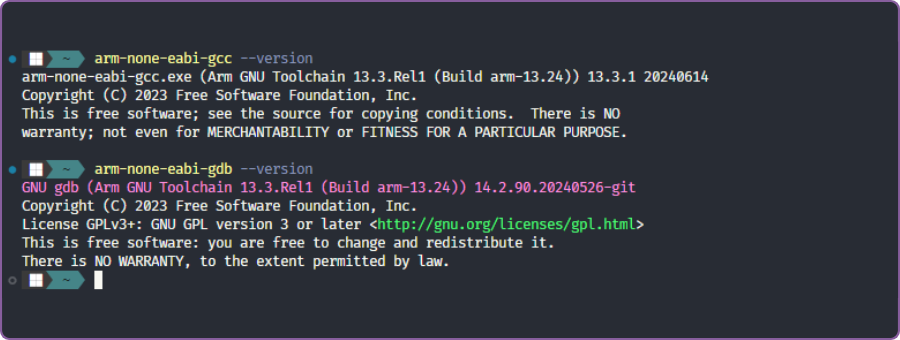
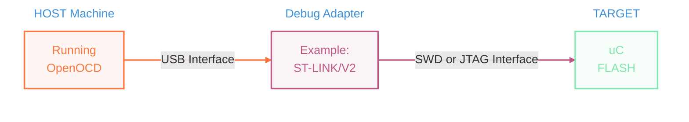

[](https://elmadichoaib.vercel.app)  

# Bare Metal Programming

`Bare metal programming` refers to writing software that runs directly on the hardware of a microcontroller without the support of an operating system or IDE. It involves manually managing hardware resources, such as memory, peripherals, and interrupts. This approach allows for more control over the hardware and is often used in embedded systems where performance and efficiency are critical.

In this project, I am using the **STM32 Nucleo-F446RE** development board. Throughout the examples and experiments, I will work with this board to write, build, and flash programs directly into its microcontroller.

The repository is structured with two main folders:

- `Src/`: Contains small learning examples and experiments created while exploring bare metal concepts step by step.
- `Main/`: Contains the actual project files.

The main project goal is to **blink the onboard LEDs LED2 and LED3** on the STM32 Nucleo board using bare metal programming, without relying on any high-level libraries or HAL code. This involves directly controlling the GPIO registers of the STM32F446RE microcontroller.

## C Programs Compilation Process

When we write a C program for a microcontroller, it goes through several steps before it can actually run on the hardware. This process includes compiling the code, assembling it, linking it into an executable, and finally flashing it onto the microcontroller.

```mermaid
graph LR
    subgraph Coding...[💻 Coding...]
        User_Application["User Application<br>(.c, .h files)"]
    end

    subgraph Building...[⚒️ Building...]
        Compiler --> Assembler["Assembler<br>(.o files)"]
        Assembler --> Linker["Linker<br>(.bin, .exe, .elf files)"]
    end

    subgraph Flashing...[📂 Flashing...]
        Programmer_and_Debugger[Programmer and<br>Debugger]
        Linker --> Programmer_and_Debugger
    end

    subgraph Running...[🏃 Running...]
        Programmer_and_Debugger --> Flash[uC Flash<br>Memory]
    end

    User_Application --> Compiler["Compiler<br>(.s, .asm files)"]

    class Coding... coding
    class User_Application user_app;
    class Building... building;
    class Compiler compiler;
    class Assembler assembler;
    class Linker linker;
    class Flashing... flashing;
    class Programmer_and_Debugger p_and_d;
    class Running... running;
    class Flash flash;

    classDef coding fill:#3D90D710,stroke:#3D90D7,stroke-width:2px,color:#3D90D7;
    classDef user_app fill:#FE774310,stroke:#FE7743,stroke-width:2px,color:#FE7743;
    classDef building fill:#3A59D110,stroke:#3A59D1,stroke-width:2px,color:#3A59D1;
    classDef compiler fill:#BE598510,stroke:#BE5985,stroke-width:2px,color:#BE5985;
    classDef assembler fill:#5F8B4C10,stroke:#5F8B4C,stroke-width:2px,color:#5F8B4C;
    classDef linker fill:#A89C2910,stroke:#A89C29,stroke-width:2px,color:#A89C29;
    classDef flashing fill:#81E7AF10,stroke:#81E7AF,stroke-width:2px,color:#81E7AF;
    classDef p_and_d fill:#FE774910,stroke:#FE7749,stroke-width:2px,color:#FE7749;
    classDef running fill:#F5C45E10,stroke:#F5C45E,stroke-width:2px,color:#F5C45E;
    classDef flash fill:#E5202010,stroke:#E52020,stroke-width:2px,color:#E52020;

    linkStyle 4 stroke:#FE7743,stroke-width:2px;
    linkStyle 0 stroke:#BE5985,stroke-width:2px;
    linkStyle 1 stroke:#5F8B4C,stroke-width:2px;
    linkStyle 2 stroke:#A89C29,stroke-width:2px;
    linkStyle 3 stroke:#FE7749,stroke-width:2px;
```

<div align="center">



</div>

Here's a quick overview of the main stages in the build process and what each one does.

<div align="center">

| Preprocessor                           | Compiler                 | Assembler                           | Linker                     |
| -------------------------------------- | ------------------------ | ----------------------------------- | -------------------------- |
| - Remove comments                      | - Generate assembly code | - Generate relocatable object files | - Combine object files     |
| - Replace macros                       |                          |                                     | - Link libraries           |
| - Include header files                 |                          |                                     | - Produce final executable |
| - Produce translation unit (`.i file`) |                          |                                     |                            |

</div>

## Cross Compilation and Toolchains

**Cross-compilation** is a process in which the cross-toolchain runs on the host machine (your PC) and creates executables that run on different machine (ARM).

**Cross-toolchain** is a collection of binaries which allows you to compile, assemble and link your applications. It contains binaries to debug the application on the target and analyze executables:

- Disassemble executables
- Dissect different sections of an executable
- Extract symbol and size information
- Convert executables to other formats (bin, ihex, ...)
- Provide C standard libraries

The toolchain we will use is GCC (**GNU Compiler Collection**), a free and open-source tool for ARM embedded processors.

### Download the GCC Toolchain

If you have installed STM32CubeIDE, the GCC toolchain is already installed with it.

If not, you can download it manually from this link: [ARM GNU Toolchain Downloads](https://developer.arm.com/downloads/-/arm-gnu-toolchain-downloads).

I am using a Windows machine, so I installed the `arm-none-eabi` version.

<div align="center">



</div>

### Important Cross Toolchain Binaries

- Compiler, Assembler, Linker `⟶` arm-none-eabi-gcc
- Assembler &nbsp;&nbsp;&nbsp;&nbsp;&nbsp;&nbsp;&nbsp;&nbsp;&nbsp;&nbsp;&nbsp;&nbsp;&nbsp;&nbsp;&nbsp;&nbsp;&nbsp;&nbsp;&nbsp;&nbsp;&nbsp;&nbsp;&nbsp;&nbsp;&nbsp;&nbsp;&nbsp; `⟶` arm-none-eabi-as
- Linker &nbsp;&nbsp;&nbsp;&nbsp;&nbsp;&nbsp;&nbsp;&nbsp;&nbsp;&nbsp;&nbsp;&nbsp;&nbsp;&nbsp;&nbsp;&nbsp;&nbsp;&nbsp;&nbsp;&nbsp;&nbsp;&nbsp;&nbsp;&nbsp;&nbsp;&nbsp;&nbsp;&nbsp;&nbsp;&nbsp;&nbsp;&nbsp;&nbsp;&nbsp; `⟶` arm-none-eabi-ld
- ELF File Analyzers &nbsp;&nbsp;&nbsp;&nbsp;&nbsp;&nbsp;&nbsp;&nbsp;&nbsp;&nbsp;&nbsp;&nbsp;&nbsp;&nbsp;&nbsp;&nbsp; `⟶` arm-none-eabi-objdump, arm-none-eabi-readelf, arm-none-eabi-nm
- Format Converter &nbsp;&nbsp;&nbsp;&nbsp;&nbsp;&nbsp;&nbsp;&nbsp;&nbsp;&nbsp;&nbsp;&nbsp;&nbsp;&nbsp;&nbsp;&nbsp; `⟶` arm-none-eabi-objcopy

### Basic Compilation Commands

The following command compiles and assembles the `main.c` file without linking, and outputs a relocatable object file `main.o`:

```bash
arm-none-eabi-gcc -c main.c -o main.o
```

This next command does the same thing but specifies the target ARM processor (**cortex-m4**) and tells the compiler to generate Thumb instruction set code:

```bash
arm-none-eabi-gcc -c -mcpu=cortex-m4 -mthumb main.c -o main.o
```

This command generates only the assembly code from `main.c`, without assembling it into an object file:

```bash
arm-none-eabi-gcc -S -mcpu=cortex-m4 -mthumb main.c -o main.s
```

### Automating Compilation with a Makefile

Instead of typing long commands every time, you can automate the process using a simple `Makefile`:

```Makefile
CC=arm-none-eabi-gcc
MACH=cortex-m4
CFLAGS= -c -mcpu=$(MACH) -mthumb -std=gnu11 -O0

# TARGET: DEPENDENCY
main.o: main.c
	$(CC) $(CFLAGS) $^ -o $@

# $^ --> dependencies (main.c)
# $@ --> target (main.o)
```

Now, just typing:

```bash
make
```

Will automatically compile `main.c` into `main.o` based on the rules you defined!

> Note: This is just the initial Makefile with one basic rule. More useful commands (called targets) will be added as we progress through the project. [Check Final Makefile Here!](#final-makefile)

If you want to dive deeper into build systems like Makefiles, CMake, and how projects are organized and automated, check out this repository: [Getting Started with CMake](https://github.com/Choaib-ELMADI/getting-started-with-cmake)

## Analyzing Build Output Files

When we compile our C programs, different types of files are generated during the build process. These files serve different purposes and understanding them is very important in bare metal programming.

### Relocatable Object Files

After compiling a C file (without linking), the compiler generates a `.o` file. This is a relocatable object file in the ELF format (**Executable and Linkable Format**) that contains different sections:

- `.text`: Contains the actual program instructions.
- `.data`: Contains initialized data.
- `.bss`: Block Starting Symbol, contains uninitialized data.
- `.rodata`: Contains read-only data.
- `.comment`: Metadata added by the compiler.
- `.ARM.attributes`: Metadata added by the compiler.

They are called **relocatable** because all sections inside the file are assigned the same starting address (usually 0x0). Similarly, the same sections across multiple object files also share the same base address. During linking, these addresses need to be relocated based on the target microcontroller (or memory map) to avoid address conflicts and data corruption.

To view the sections in the `main.o` file, run the following command:

```bash
arm-none-eabi-objdump -h main.o
```

The output of this command looks like this:

```bash
main.o:     file format elf32-littlearm

Sections:
Idx Name            Size      VMA       LMA       File off  Algn
  0 .text           00000520  00000000  00000000  00000034  2**2
                    CONTENTS, ALLOC, LOAD, RELOC, READONLY, CODE
  1 .data           00000001  00000000  00000000  00000554  2**0
                    CONTENTS, ALLOC, LOAD, DATA
  2 .bss            00000054  00000000  00000000  00000558  2**2
                    ALLOC
  3 .rodata         000000c9  00000000  00000000  00000558  2**2
                    CONTENTS, ALLOC, LOAD, READONLY, DATA
  4 .comment        00000046  00000000  00000000  00000621  2**0
                    CONTENTS, READONLY
  5 .ARM.attributes 0000002e  00000000  00000000  00000667  2**0
                    CONTENTS, READONLY
```

To disassemble the `.text` section and write it to a file, run:

```bash
arm-none-eabi-objdump -d main.o > main_log.txt
```

For more commands and options, check the documentation here: [View More Commands](https://gcc.gnu.org/onlinedocs/gcc-13.3.0/gcc/#toc-GCC-Command-Options)

### MCU Startup File

The **startup file** is an assembly or C file that prepares the microcontroller to run a C program. It mainly does the following tasks:

- Set up the initial stack pointer.
- Define the interrupt vector table.
- Provide default handlers for interrupts and exceptions.
- Call the `Reset_Handler`, which initializes the main memory with data in `.data` and `.bss` sections, and then calls the `main` function.

In the build output, you will find or create a startup file specific to the microcontroller you are using. For the STM32 Nucleo-F446RE, the startup file is `stm32f446xx_startup.s` or `stm32f446xx_startup.c`.

### Linker Script

A **linker script** is used to define how the program's sections (`.text`, `.data`, and `.bss`) are arranged in memory. Linker scripts are written using the **GNU linker command language** and usually have a `.ld` file extension.

You must supply the linker script during the linking phase by using the `-T` option with the linker.

Linker scripts use special **symbols**, which are names associated with memory addresses (`_etext`, `_sdata`, `_edata`). These symbols help the linker correctly place and reference data and code. They are part of the **symbol table** created during linking and can also be accessed in your C code using `extern`.

Some important keywords used when writing linker scripts are:

- `ENTRY(symbol)`: Defines the entry point (**Reset_Handler**) of the program.
- `MEMORY`: Defines the available memory regions (FLASH, RAM, ...) and their sizes.
- `SECTIONS`: Describes how the program sections should be placed into the memory regions.
- `> REGION`: Specifies into which memory region a section should be placed.
- `AT > REGION`: Specifies the load memory address for a section.
- `KEEP()`: Forces the linker to keep certain sections or symbols.
- `ALIGN(n)`: Aligns sections or symbols to a specific memory boundary (n bytes).
- `.`: Refers to the **location counter**, which tracks the current memory address during linking. It is automatically incremented by the size of current section.

To generate the final executable file, use the following command:

```bash
arm-none-eabi-gcc -nostdlib -T stm32f446xx_ls.ld *.o -o final.elf
```

### Memory Map File

To better understand how the linker placed each section and symbol in memory, you can generate a **memory map file** during the linking phase. This file shows details like section sizes, memory addresses, and symbol locations. This is very useful for debugging memory issues or verifying that your linker script works correctly.

To generate it, use the `-Wl,-Map=final.map` flag with the linker:

```bash
arm-none-eabi-gcc -nostdlib -T stm32f446xx_ls.ld *.o -Wl,-Map=final.map -o final.elf
```

## Downloading and Debugging Executables

Our goal is to flash the final generated executable into the microcontroller’s internal flash memory and run the program on the development board. We will do this using one method:

- **Using a debug adapter** to connect the target to the host. This is called **in-circuit programming/debugging**.

<div align="center">



</div>

### OpenOCD (Open On-Chip Debugger)

**OpenOCD** is a free and open-source tool that runs on the host machine. It allows you to flash, debug, and test embedded systems:

- It supports many processors like ARM7, ARM9, Cortex-M, and Intel Quark.
- It works with different debug adapters such as ST-LINK, J-Link, or others.
- It uses the **GDB protocol** to allow stepping through code, setting breakpoints, and inspecting variables.
- It supports **flash programming** for internal and external flash memories on various microcontrollers.
- It’s widely used with STM32 boards and works well with `arm-none-eabi-gdb`.

### Installing and Running OpenOCD

To use OpenOCD, you need to install it and make sure it’s available in your system path:

- Download it from the official site: [Download OpenOCD for Windows](https://gnutoolchains.com/arm-eabi/openocd/)
- After extracting, add the `bin` folder (where `openocd.exe` is located) to your system's **Path** environment variable.
- Make sure your development board is connected to your PC **before** running the OpenOCD command.
- To run OpenOCD with your STM32 board, use the following command:

```bash
openocd -f board/st_nucleo_f4.cfg
```

> Note: Make sure to use the correct `.cfg` file for your specific development board.

To quit OpenOCD, simply press: `Ctrl + C`.

### Flashing and Debugging using GDB

Once the OpenOCD server is running, follow these steps in a new terminal:

- Start the GDB client:

```bash
arm-none-eabi-gdb
```

- Connect to the OpenOCD server:

```bash
target remote localhost:3333
```

- After connecting, always run this to reset and initialize the target:

```bash
monitor reset init
```

- Finally, flash the executable into the microcontroller:

```bash
monitor flash write_image erase final.elf
```

The program is now flashed to the board. You can start debugging it from GDB.

### Useful GDB Commands

Here are some GDB commands to control and inspect the MCU:

- Reset and halt the MCU immediately:

```bash
monitor reset halt
```

- Resume program execution:

```bash
monitor resume
```

- Reset the MCU without halting:

```bash
monitor reset
```

- Halt program execution:

```bash
monitor halt
```

- Read memory at a specific address:

```bash
monitor size address count # size = mdd | mdw | mdh | mdb
```

- Add a breakpoint at a specific address:

```bash
monitor bp address length type # type = hw | sw
```

- Remove a breakpoint:

```bash
monitor rbp address
```

- Exit GDB:

```bash
quit # or exit
```

These commands allow you to fully control program execution, set breakpoints, read memory, and debug issues. More commands here: [OpenOCD General Commands](https://openocd.org/doc/html/General-Commands.html)

## Integrating C Standard Libraries and Semihosting

To use C standard library features like `printf`, `malloc`, or `open`, embedded systems need a minimal C library. The GNU ARM toolchain provides two options:

- **newlib**: Full-featured C library implementation.
- **newlib-nano**: A smaller, lightweight version optimized for embedded systems.

Both are automatically installed when you install the GNU ARM toolchain.

### System Calls and `syscalls.c`

Since microcontrollers do not have an operating system to provide standard I/O or file management, **newlib** relies on **low-level system call stubs** that you must implement yourself.

These are typically defined in a file called `syscalls.c`, and include functions like:

- `_write` used for `printf()`
- `_read` used for `scanf()`
- `_open`, `_close`, `_lseek`, `_fstat`, `_isatty`, `_sbrk`, ...

By implementing these functions, you tell newlib how to handle I/O operations (like redirecting output to a UART or debugger console) and memory allocation.

### Enabling Semihosting

**Semihosting** is a technique that allows your embedded program to communicate with your host machine through the debug interface. It enables functions like `printf` to send output directly to your PC (inside the OpenOCD terminal), even if the microcontroller doesn’t have a display. To use semihosting:

- Compile your project with this flag:

```bash
--specs=rdimon.specs
```

- After starting the GDB client, enable semihosting with:

```bash
monitor arm semihosting enable
```

- Then reset the MCU to start the program:

```bash
monitor reset
```

Now, any output from functions like `printf()` will appear directly in the OpenOCD terminal.

- To safely disconnect OpenOCD from the target when you're done, use:

```bash
monitor shutdown
```

## Final Makefile

Here is the final `Makefile` used in this project:

```Makefile
CC = arm-none-eabi-gcc
MACH = cortex-m4
CFLAGS = -c -mcpu=$(MACH) -mthumb -mfloat-abi=soft -std=gnu11 -Wall -O0
CSFLAGS = -S -mcpu=$(MACH) -mthumb -mfloat-abi=soft -std=gnu11 -Wall -O0
# LDFLAGS = -nostdlib -T stm32f446xx_ls.ld -Wl,-Map=final.map
LDFLAGS = -mcpu=$(MACH) -mthumb -mfloat-abi=soft --specs=nano.specs -T stm32f446xx_ls.ld -Wl,-Map=final.map
LDFLAGS_SH = -mcpu=$(MACH) -mthumb -mfloat-abi=soft --specs=rdimon.specs -T stm32f446xx_ls.ld -Wl,-Map=final.map

all: main.s main.o led.o stm32f446xx_startup.o syscalls.o final.elf

# sh = SEMIHOSTING
sh: main.s main.o led.o stm32f446xx_startup.o final_sh.elf

main.s: main.c
	$(CC) $(CSFLAGS) $^ -o $@

main.o: main.c
	$(CC) $(CFLAGS) $^ -o $@

led.o: led.c
	$(CC) $(CFLAGS) $^ -o $@

stm32f446xx_startup.o: stm32f446xx_startup.c
	$(CC) $(CFLAGS) $^ -o $@

syscalls.o: syscalls.c
	$(CC) $(CFLAGS) $^ -o $@

final.elf: main.o led.o stm32f446xx_startup.o syscalls.o
	$(CC) $(LDFLAGS) $^ -o $@

final_sh.elf: main.o led.o stm32f446xx_startup.o
	$(CC) $(LDFLAGS_SH) $^ -o $@

clean:
	clear; rm -r *.s *.o *.elf *.map

load:
	openocd -f board/st_nucleo_f4.cfg
```

Happy learning and happy building!
