# Bare Metal Programming

`Bare metal programming` refers to writing software that runs directly on the hardware of a microcontroller without the support of an operating system or IDE. It involves manually managing hardware resources, such as memory, peripherals, and interrupts. This approach allows for more control over the hardware and is often used in embedded systems where performance and efficiency are critical.

## C Program Compilation Process

```mermaid
graph LR
    subgraph Coding...[💻 Coding...]
        User_Application["User Application<br>(.c, .h files)"]
    end

    subgraph Building...[⚒️ Building...]
        Compiler --> Assembler["Assembler<br>(.o files)"]
        Assembler --> Linker["Linker<br>(.exe, .elf files)"]
    end

    subgraph Flashing...[📂 Flashing...]
        Programmer_and_Debugger[Programmer and<br>Debugger]
        Linker --> Programmer_and_Debugger
    end

    subgraph Running...[🏃 Running...]
        Programmer_and_Debugger --> Flash[uC Flash<br>Memory]
    end

    User_Application --> Compiler["Compiler<br>(.s, .asm files)"]

    class Coding... coding
    class User_Application user_app;
    class Building... building;
    class Compiler compiler;
    class Assembler assembler;
    class Linker linker;
    class Flashing... flashing;
    class Programmer_and_Debugger p_and_d;
    class Running... running;
    class Flash flash;

    classDef coding fill:#3D90D710,stroke:#3D90D7,stroke-width:2px,color:#3D90D7;
    classDef user_app fill:#FE774310,stroke:#FE7743,stroke-width:2px,color:#FE7743;
    classDef building fill:#3A59D110,stroke:#3A59D1,stroke-width:2px,color:#3A59D1;
    classDef compiler fill:#BE598510,stroke:#BE5985,stroke-width:2px,color:#BE5985;
    classDef assembler fill:#5F8B4C10,stroke:#5F8B4C,stroke-width:2px,color:#5F8B4C;
    classDef linker fill:#A89C2910,stroke:#A89C29,stroke-width:2px,color:#A89C29;
    classDef flashing fill:#81E7AF10,stroke:#81E7AF,stroke-width:2px,color:#81E7AF;
    classDef p_and_d fill:#FE774910,stroke:#FE7749,stroke-width:2px,color:#FE7749;
    classDef running fill:#F5C45E10,stroke:#F5C45E,stroke-width:2px,color:#F5C45E;
    classDef flash fill:#E5202010,stroke:#E52020,stroke-width:2px,color:#E52020;

    linkStyle 4 stroke:#FE7743,stroke-width:2px;
    linkStyle 0 stroke:#BE5985,stroke-width:2px;
    linkStyle 1 stroke:#5F8B4C,stroke-width:2px;
    linkStyle 2 stroke:#A89C29,stroke-width:2px;
    linkStyle 3 stroke:#FE7749,stroke-width:2px;
```

| Preprocessor                           | Compiler                 | Assembler                        | Linker                     |
| -------------------------------------- | ------------------------ | -------------------------------- | -------------------------- |
| - Remove comments                      | - Generate assembly code | - Generate object (binary) files | - Combine object files     |
| - Replace macros                       |                          |                                  | - Link libraries           |
| - Include header files                 |                          |                                  | - Produce final executable |
| - Produce translation unit (`.i file`) |                          |                                  |                            |

